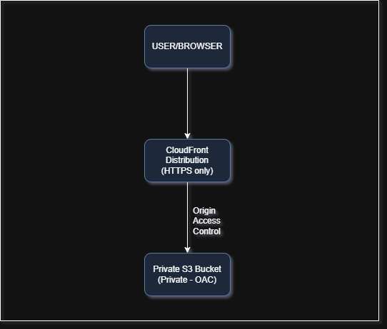
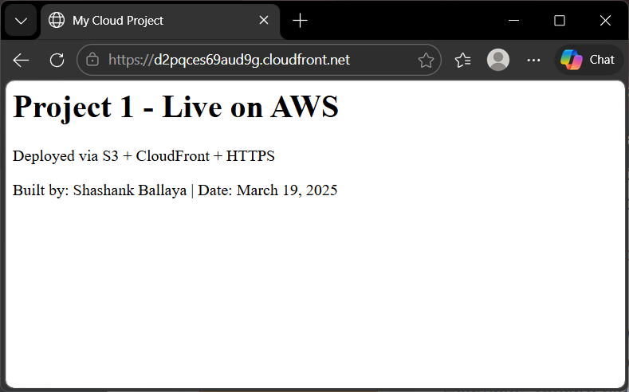
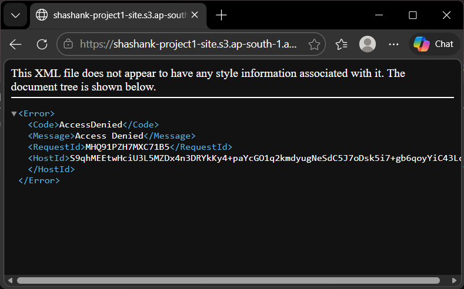

# AWS Static Website - S3 + CloudFront + HTTPS

>  A production-grade static website hosted on AWS using a private S3 bucket and CloudFront CDN with HTTPS enforcement. The S3 bucket is never publicly accessible - all traffic flows exclusively through CloudFront.
Check out the link here:[Link](https://d2pqces69aud9g.cloudfront.net/)
---

## Architecture 



```
User / Browser
	|
	|
	v
CloudFront Distribution
(CDN + HTTPS + Private S3 Access)
	|
	| CloudFront origin access (private)
	| AWS auto-manages S3 bucket policy 
	v
S3 Bucket (Private - Block all public access)
	|
	_ index.html
	_ error.html
```

**Key security principle:** The S3 bucket has all public access blocked. AWS automatically configures CloudFront with private bucket access - only the CloudFront distribution can read objects from S3. Accessing the S3 object URL directly returns `Access Denied`.

---

## Tech Stack

| Service | Purpose |
|---|---|
| AWS CloudFront | CDN - global content delivery + HTTPS enforcement |
| CloudFront Private S3 Access | Restricts S3 access to CloudFront only (replaces legacy OAC flow) |
| AWS CLI | All file uploads and syncs - no manual console uploads |

---

## How to Deploy 

Follow these steps exactly. All file uploads use the AWS CLI - not the console.

**Prerequisites**
- AWS account with IAM user configured.
- AWS CLI installed and configured (`aws configure`).
- draw.io or equivalent for architecture diagram.

**Step 1 - Create the HTML files**

Create `./site/index.html`:
```html
<!DOCTYPE html>
<html>
  <head><title>My Cloud Project</title></head>
  <body>
    <h1>Project 1 — Live on AWS</h1>
    <p>Deployed via S3 + CloudFront + HTTPS</p>
    <p>Built by: [Shashank Ballaya] | Date: [19 March, 2026]</p>
  </body>
</html>
```

Create `./site/error.html`:
```html
<!DOCTYPE html>
<html>
  <body><h1>404 — Page Not Found</h1></body>
</html>
```
**Step 2 - Create a private S3 bucket**
 
```bash
# Create bucket (replace with your unique name)
aws s3 mb s3://shashank-project1-site --region ap-south-1
```
 
In the AWS Console:
- S3 → your bucket → Permissions → Block public access
- Enable all 4 checkboxes → Save
- Confirm: the S3 object URL returns `Access Denied`
 
**Step 3 - Upload files via CLI**
 
```bash
# Upload all files from local site folder to S3
aws s3 sync ./site s3://shashank-project1-site/
 
# Verify files are uploaded
aws s3 ls s3://shashank-project1-site/
```
 
**Step 4 - Create CloudFront distribution**
 
In the AWS Console → CloudFront → Create distribution:
 
- **Step 1 (Get started):**
  - Distribution type: Single website or app
  - Leave domain fields empty
 
- **Step 2 (Specify origin):**
  - Origin type: Amazon S3
  - S3 origin: click "Browse S3" → select your bucket from the list
    *(Do not type the bucket name manually - OAC only works when selected from the list)*
  - **Allow private S3 bucket access to CloudFront: select "Recommended"**
    *(This is the new name for Origin Access Control - AWS auto-manages the S3 bucket policy)*
  - Origin settings: Use recommended
  - Cache settings: Use recommended cache settings tailored to S3
 
- **Step 3 (Enable security):**
  - WAF: Do not enable security protections *(skip - costs money)*
 
- **Step 4 (Review and create):**
  - Confirm "Grant CloudFront access to origin: Yes"
  - Click **Create distribution**
 
**Step 5 - Set default root object**
 
After distribution is created:
- CloudFront → your distribution → Settings tab → Edit
- Default root object: `index.html`
- Save changes
 
**Step 6 - Verify S3 bucket policy was auto-updated**
 
- S3 → your bucket → Permissions → Bucket policy
- AWS automatically writes a policy restricting access to your CloudFront distribution only
- If the policy is empty: go back to CloudFront → distribution → Origins → Edit → re-save
 
**Step 7 - Wait and test**
 
- Wait 5–15 minutes for CloudFront status to change from `Deploying` → `Enabled`
- Visit: `https://d2pqces69aud9g.cloudfront.net`
- ✅ Website must load over HTTPS (padlock visible in browser)
 
- ✅ Direct S3 object URL must still return `Access Denied`
 
 
**Step 8 — Update files (future deployments)**
 
```bash
# Sync updated files to S3
aws s3 sync ./site s3://yourname-project1-site/
```
 
---
 
## Verification Checklist
 
- [ ] S3 bucket has all public access blocked
- [ ] Files uploaded via `aws s3 sync` - not console drag-and-drop
- [ ] CloudFront distribution status: Enabled
- [ ] S3 bucket policy auto-updated by AWS (CloudFront private access)
- [ ] Default root object set to `index.html`
- [ ] `https://d2pqces69aud9g.cloudfront.net` loads website with HTTPS padlock
- [ ] Direct S3 object URL returns `Access Denied`
 
---
 
## CLI Commands Used
 
```bash
# Create bucket
aws s3 mb s3://shashank-project1-site --region ap-south-1
 
# Upload files
aws s3 sync ./site s3://shashank-project1-site/
 
# List bucket contents
aws s3 ls s3://shashank-project1-site/
 
# Verify AWS identity (confirm correct account)
aws sts get-caller-identity
```
 
---
 
## What I Learned
 
- S3 buckets should never be made public for website hosting - CloudFront private access is the correct production pattern
- The new AWS CloudFront wizard (2024-2025) handles Origin Access Control automatically under "Allow private S3 bucket access to CloudFront" - no manual OAC creation or bucket policy copy-paste required
- CloudFront takes 5-15 minutes to deploy - changes to settings (like default root object) also require a few minutes to propagate
- `aws s3 sync` only uploads changed files - efficient for future updates
- CloudFront cache invalidation (`/*`) is required after updating files, so users get the latest version immediately
 
---
 
## Cost Estimate
 
This project runs entirely within AWS Free Tier limits:
 
| Service | Free Tier | This project |
|---|---|---|
| S3 storage | 5 GB / month | < 1 MB |
| S3 requests | 20,000 GET / month | Minimal |
| CloudFront data transfer | 1 TB / month | < 1 MB |
| CloudFront requests | 10,000,000 / month | Minimal |
 
**Estimated monthly cost: $0.00** within free tier
 
---
 
## Skills Demonstrated
 
- AWS S3 - private bucket configuration, object storage, CLI management
- AWS CloudFront - CDN setup, HTTPS enforcement, private S3 origin access
- AWS CLI - bucket creation, file sync, cache invalidation
- Security best practice - zero public S3 exposure, all traffic through HTTPS CDN
- Infrastructure documentation - architecture diagrams, reproducible deploy steps
 
---
 
*Built as Project 1 of the Junior Cloud Engineer roadmap*

